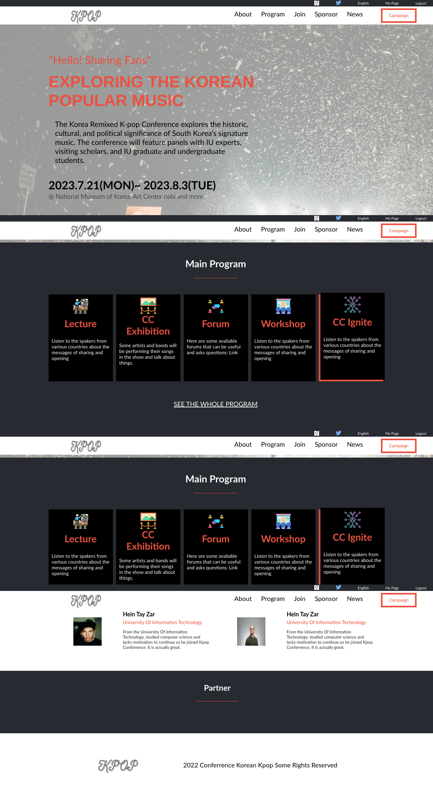

# Kpop Conferrence

> Description of Kpop Conferrence.
This is the "Kpop Conferrence" Project with just Html and Css(scss).  
No frameworks

## Description
This page is designed for a conferrence disscussing about Korean popular music.
<h2>Desktop Version</h2>

<h2>Mobile Version</h2>

## Built With

Html and Css(scss)

## Getting Started

git clone https://github.com/heintayzar-hm/capstone.git

To get a local copy up and running follow these simple example steps.

### Prerequisites
You have basic knowledge of Html, Css, and code editor.
### Setup

### Install
npm install  
npm install concurrently  
npm run build (So that you can make changes in scss file) 
### Usage
Free feel to use the project as you like

### Run tests
You can use vscode extension or just run the index file. (I have yet to set up local server)

### Deployment

## Contact me

<a href="https://github.com/heintayzar-hm/">Github</a>

<a href="https://twitter.com/heintayzarhm">Twitter</a>

<a href="https://www.linkedin.com/in/hein-tay-zar/">LinkedIn</a>

## Issues
You can make a PR or make an issue if you found problems

## Show your support
Give me a star if it is your taste

## Acknowledgments

Great Thanks to the desigin idea <a href="https://www.behance.net/adagio07">Cindy Shin on Behance</a>
Original design <a href="https://www.behance.net/gallery/29845175/CC-Global-Summit-2015">CC-Global-Summit-2015</a> 

<h3>Photos are from <a href="https://unsplash.com/s/photos/korean-people?utm_source=unsplash&utm_medium=referral&utm_content=creditCopyText">Unsplash</a></h3>
Photo by <a href="https://unsplash.com/@munga_thigani?utm_source=unsplash&utm_medium=referral&utm_content=creditCopyText">Munga Thigani</a> on <a href="https://unsplash.com/s/photos/korean-people?utm_source=unsplash&utm_medium=referral&utm_content=creditCopyText">Unsplash</a>
  

Photo by <a href="https://unsplash.com/es/@darranshen?utm_source=unsplash&utm_medium=referral&utm_content=creditCopyText">Darran Shen</a> on <a href="https://unsplash.com/s/photos/korean-people?utm_source=unsplash&utm_medium=referral&utm_content=creditCopyText">Unsplash</a>

Photo by <a href="https://unsplash.com/@wocintechchat?utm_source=unsplash&utm_medium=referral&utm_content=creditCopyText">Christina @ wocintechchat.com</a> on <a href="https://unsplash.com/s/photos/korean-people?utm_source=unsplash&utm_medium=referral&utm_content=creditCopyText">Unsplash</a>
  

Photo by <a href="https://unsplash.com/@erik_lucatero?utm_source=unsplash&utm_medium=referral&utm_content=creditCopyText">Erik  Lucatero</a> on <a href="https://unsplash.com/s/photos/korean-people?utm_source=unsplash&utm_medium=referral&utm_content=creditCopyText">Unsplash</a>
  
Photo by <a href="https://unsplash.com/@fotosushi?utm_source=unsplash&utm_medium=referral&utm_content=creditCopyText">Foto Sushi</a> on <a href="https://unsplash.com/s/photos/korean-people?utm_source=unsplash&utm_medium=referral&utm_content=creditCopyText">Unsplash</a>
  
Photo by <a href="https://unsplash.com/ja/@freestocks?utm_source=unsplash&utm_medium=referral&utm_content=creditCopyText">freestocks</a> on <a href="https://unsplash.com/s/photos/korean-people?utm_source=unsplash&utm_medium=referral&utm_content=creditCopyText">Unsplash</a>
  
Photo by <a href="https://unsplash.com/@yvettedewit?utm_source=unsplash&utm_medium=referral&utm_content=creditCopyText">Yvette de Wit</a> on <a href="https://unsplash.com/s/photos/concert?utm_source=unsplash&utm_medium=referral&utm_content=creditCopyText">Unsplash</a>
  
Photo by <a href="https://unsplash.com/@dannyhowe?utm_source=unsplash&utm_medium=referral&utm_content=creditCopyText">Danny Howe</a> on <a href="https://unsplash.com/s/photos/concert?utm_source=unsplash&utm_medium=referral&utm_content=creditCopyText">Unsplash</a>
  

<h3>Icons are from <a href="https://www.flaticon.com/free-icons/">Flaticon</a></h3>
<a href="https://www.flaticon.com/free-icons/teaching" title="teaching icons">Teaching icons created by Eucalyp - Flaticon</a>

<a href="https://www.flaticon.com/free-icons/exhibition" title="exhibition icons">Exhibition icons created by Freepik - Flaticon</a>

<a href="https://www.flaticon.com/free-icons/group" title="group icons">Group icons created by Freepik - Flaticon</a>

<a href="https://www.flaticon.com/free-icons/workshop" title="workshop icons">Workshop icons created by Flat Icons - Flaticon</a>

<a href="https://www.flaticon.com/free-icons/spread" title="spread icons">Spread icons created by photo3idea_studio - Flaticon</a>
